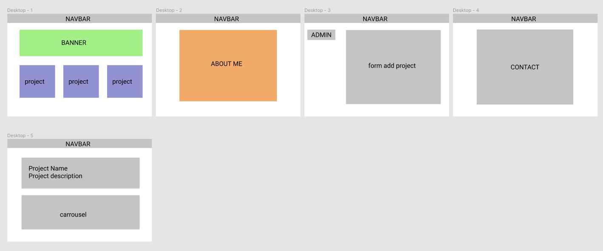
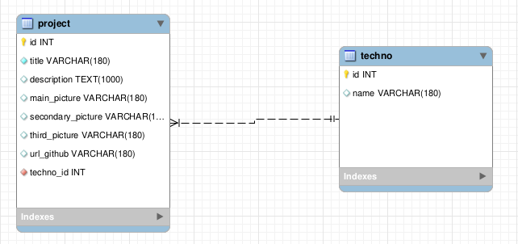

# Portfolio

## Tech

The portfolio is a react-app and its back is run with express/mySQL.
Simply run npm start to get started.

Link to back: [BackEnd](https://github.com/eddymandran/portfolio-back)

## User story

Users will be able to:

- Add a new project
- Delete a un project
- See more information on a project

## Wireframes/MockUps

## DataBase

